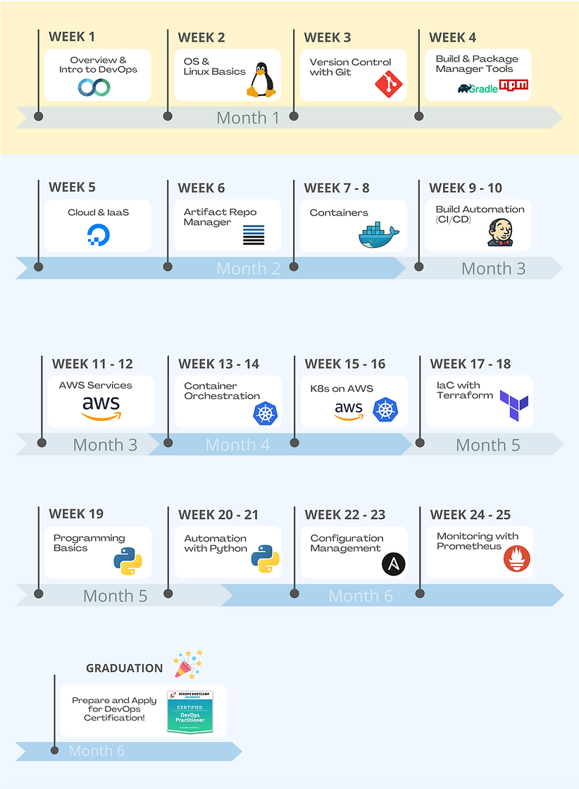

# twn_devops_bootcamp

This repository is used to store all the code and notes used during the DevOps Bootcamp by Techworld with Nana.

This project consists of:
- Demo Projects
- Notes (they were written during the course and are neither complete nor perfect)
- Smaller helpers/scripts used during the course in the exercises

## Java-Maven-App repo
In this course another [Repository](https://github.com/kvn-31/twn_java-maven-app/tree/build-and-deploy-k8s-ecr) was created. It consists of various different Jenkins pipelines and was used to create a multi-branch pipeline.

## Course Roadmap

