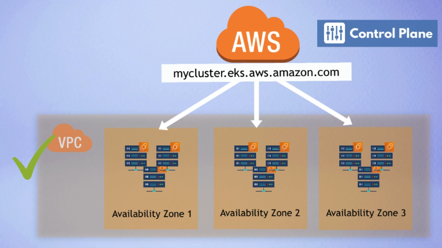

# Terraform - EKS

In this demo project we use terraform to create an EKS cluster. We also create a VPC with public and private subnets.

### Used Terraform Modules

- [VPC](https://registry.terraform.io/modules/terraform-aws-modules/vpc/aws/latest)
- [EKS](https://registry.terraform.io/modules/terraform-aws-modules/eks/aws/latest)

Using these modules saves us a lot of time and effort. Needed resources that would have to be created manually are added automatically, such as the IAM roles, policies, route table for private/public, SGs, internet gateway etc.

We are using three different azs (availability zones). Following best practice we have one public and one private subnet
in each az.
The setup can be seen in the following image:


Managed node groups are used to create the worker nodes. The worker nodes are created in the private subnets.

```tf
  eks_managed_node_groups = {
  dev = {
    min_size     = 1
    max_size     = 3
    desired_size = 2

    instance_types = ["t2.small"]
  }
}
```

### VPC Setup

Apart from setting up 3 public and 3 private subnets, we also create a single NAT gateway that is shared across the
private subnets.
In order to detect the vpc with the k8s ccm (cloud controller manager) we tag the vpc with the following tag:

```tf
  tags = {
  "kubernetes.io/cluster/myapp-eks-cluster" = "shared"
}
```

The same needs to be done for the private & public subnet.
Finally, an elastic load balancer is set for the public subnets using `kubernetes.io/role/elb` tag and an internal load
balancer for the private subnets using `kubernetes.io/role/internal-elb` tag for the private subnets.

### Connect using kubectl
- Prerequisites: `aws-iam-authenticator` and `kubectl` installed
- Run the following command to get the kubeconfig file:
```bash
aws eks update-kubeconfig --name CLUSTERNAME --region REGION 
```
- verify the connection:
```bash
kubectl get node
```
- also, a simple nginx deployment with a load balancer service can be created:
```bash
kubectl apply -f nginx_deployment.yaml
```
- this should create a load balancer service that can be accessed from the internet. Using the load balancer dns name we can access the nginx service.

## Note about a hack that needs to be done
After creating the EKS cluster, I was not able to connect to it using `kubectl`. I was getting 401 errors.

No idea why and this is definitely not recommended, but i ended up navigating to the cluster in AWS management console. There was a message that my user had no access so I created an IAM ACCESS entry for my user.
  `arn:aws:iam::AWSACCOUNTID:user/USERNAME` -> appended AmazonEKSAdminPolicy, AmazonEKSAdminViewPolicy, AmazonEKSClusterAdminPolicy, AmazonEKSViewPolicy and now it is working.
	
