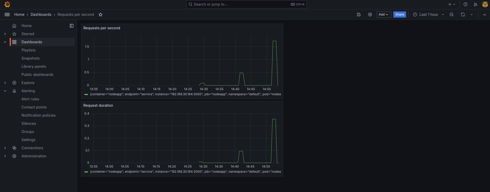

# Prometheus Demo

Prometheus will be setup Prometheus in an EKS cluster using a Helm chart. This will automatically deploy Prometheus, Grafana, and other components.

This project enables logging for:
- Kubernetes cluster
- Kubernetes' components (microservices application)
- Prometheus stack
- 3rd party components (Redis)
- monitor own application (simple node.js application)

In addition, alert rules are defined to trigger alerts when certain conditions are met.

Already existing alert rules (navigate to Prometheus UI -> Alerts -> Rules):
- most of them are for the Prometheus stack itself
- most of them are inactive or condition not met

Alert rules that were added:
- CPU > 50%
- when a Pod cannot start
They can be found in the `alert-rules.yaml` file.

Also, an alert manager configuration was added to send alerts via email. The configuration can be found in the `alert-manager-configuration-base.yaml` file (email needs to be replaced). For this, also a secret was created, see `email-secret-template.yaml`.

To be able to monitor redis (3rd party) the [redis-exporter](https://github.com/oliver006/redis_exporter) is used. It is deployed using the `redis-exporter.yaml` file.


## Prerequisites
- EKS cluster
  - with deployed microservices application
  - can be done using eksctl
  - `eksctl create cluster` (default options)
  - `kubectl apply -f config-loadbalancer.yaml` to deploy the microservices application

## Steps
1. Deploy Prometheus using Helm
- `helm repo add prometheus-community https://prometheus-community.github.io/helm-charts`
- `helm repo update`
- `kubectl create ns monitoring`
- `helm install monitoring prometheus-community/kube-prometheus-stack -n monitoring`
- `kubectl --namespace monitoring get pods -l "release=monitoring"` to check if all pods are running (alternatively `kubectl get all -n monitoring`)
2. Monitor Kubernetes cluster
3. Monitor microservices application

## Commands
- `kubectl port-forward service/monitoring-kube-prometheus-prometheus 9090:9090 -n monitoring &` to access Prometheus UI
- `kubectl port-forward service/monitoring-grafana 8080:80 -n monitoring &` to access Grafana UI (default credentials: admin/prom-operator)
- `kubectl port-forward service/monitoring-kube-prometheus-alertmanager 9093:9093 -n monitoring &` to access Alertmanager UI
- `kubectl run curl-test --image=radial/busyboxplus:curl -i --tty --rm` to add a pod which will 
- to test the visualization under load it is an option to run the following
  - `kubectl run curl-test --image=radial/busyboxplus:curl -i --tty --rm`
  - `vi test.sh` and add the following to curl the loadbalancer
    ```bash
    for i in $(seq 1 10000); do
      curl http://<loadbalancer-dns-name> > test.txt 
    done
    ```
  - `chmod +x test.sh` make the script executable
 
### Add custom alerts
- `kubectl apply -f alert-rules.yaml` to add alert rules
- `kubectl get PrometheusRule -n monitoring` to check if the alert rules are added

### Add alert receivers
- `kubectl apply -f email-secret.yaml` to add the email secret (base64 encoded password, do not check in)
- `kubectl apply -f alert-manager-configuration-base.yaml` to add the alert manager configuration

### Debug Alertmanager
- `kubectl logs alertmanager-monitoring-kube-prometheus-alertmanager-0 -n monitoring -c alertmanager` to check the logs of the Alertmanager pod

### Debugging after applying Kubernetes changes
- after applying changes to Kubernetes resources it is a good idea to check the logs of the Prometheus pod
- `kubectl get pod -n monitoring` to get the name of the Prometheus pod
- `kubectl logs <prometheus-pod-name> -n monitoring` to check the logs (might need to specify a specific one -> might need to add `-c CONTAINERNAME` to the command)

## Test Alert Rules
- to simulate a high CPU load we will use [containerstack/cpustress dockerhub image](https://hub.docker.com/r/containerstack/cpustress)
  - `kubectl run cpu-test --image=containerstack/cpustress -- --cpu 4 --timeout 60s --metrics-brief` -> the `--` is used to pass arguments to the container, `cpu-test` is the name we gave the pod
  - `kubectl delete pod cpu-test` to stop the pod
  - check `http://localhost:9093/api/v2/alerts` to see the alerts

## Setup Redis Exporter
- using the [Helm chart](https://github.com/prometheus-community/helm-charts/tree/main/charts/prometheus-redis-exporter)
- `helm repo add prometheus-community https://prometheus-community.github.io/helm-charts`
- `helm repo update`
- `helm install redis-exporter prometheus-community/prometheus-redis-exporter -f redis-values.yaml`
- `kubectl get servicemonitor`, `kubectl get pod`, `helm ls` to check if everything is running
- port-forward Prometheus UI and check the targets -> should see the redis-exporter target

## Prometheus Rules for Redis
- rules taken from [awesome-prometheus-alerts](https://samber.github.io/awesome-prometheus-alerts/rules#redis)
- `kubectl apply -f redis-rules.yaml`
- check Prometheus UI -> Alerts (might take some minutes to show up)

## Test Redis Rules
- `kubectl edit deployment redis-cart` and change number of replicas to 0 -> alert will fire

## Create Redis Dashboard in Grafana
- find a dashboard on grafana.com -> in our case [this one](https://grafana.com/grafana/dashboards/763-redis-dashboard-for-prometheus-redis-exporter-1-x/)
- Grafana UI - Dashboard - Manage - Import

## Monitor own application (simple node.js application)
- using prom-client
- see [nodejs-app-monitoring](./nodejs-app-monitoring/README.md) (run docker build, push to docker hub)
- in `k8s-config.yaml` replace the image with the correct one
- to be able to pull from private docker hub registry, a secret needs to be created
  - `kubectl create secret docker-registry my-registry-key --docker-server=https://index.docker.io/v1/ --docker-username=<username> --docker-password=<password>`
- `kubectl apply -f k8s-config.yaml` adds Deployment, Service and ServiceMonitor (to tell Prometheus to scrape metrics) to the cluster
- to check if the Target was added as expected port forward the Prometheus UI and check the Targets (might take some minutes to show up) -> every request to fort-forwarded application (localhost:3000) should add +1 to `http_request_operations_total` metric
- `kubectl port-forward service/nodeapp 3000:3000` to access the application (http://localhost:3000/metrics for the metrics)

## Add Grafana Dashboard for own application (simple node.js application)
- go to grafana dashboard - new - new dashboard - add panel - edit - metrics - prometheus - query (code) `rate(http_request_operations_total[2m])` - save
- go to grafana dashboard - new - new dashboard - add panel - edit - metrics - prometheus - query (code) `rate(http_request_duration_seconds_sum[2m])` - save



## Files
- this project consists of various .yaml files that are used to deploy the shopping example application. They are quite similar, but only the `config-loadbalancer.yaml` is used to deploy the application.
- `alert-rules.yaml` contains the alert rules that are added to Prometheus
- `alert-manager-configuarion.yaml` contains the alert manager configuration
- `email-secret-template.yaml` use for the email secret
- `alert-manager-configuration-base.yaml` contains the alert manager configuration -> email needs to be replaced
- `redis-values.yaml` contains the Redis exporter configuration
- `redis-rules.yaml` contains the Prometheus rules for Redis

## Limitations
Note that to send the email via gmail the following settings need to be set:
- allow less secure apps: https://myaccount.google.com/lesssecureapps
